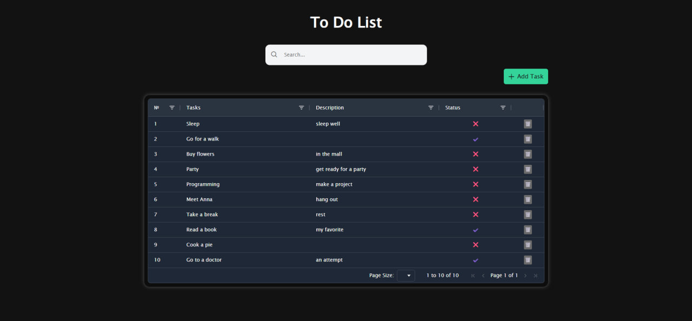
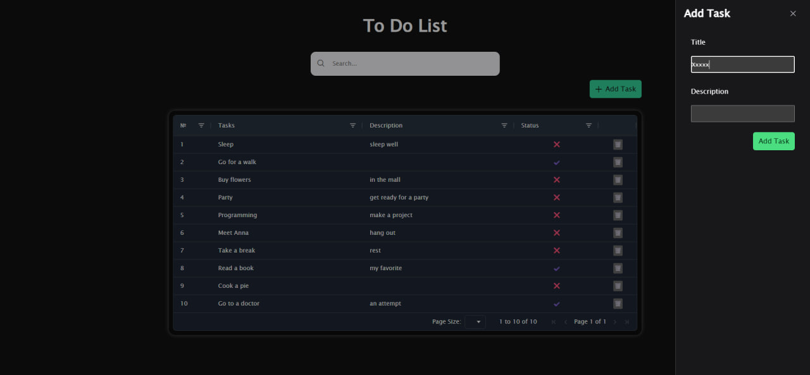
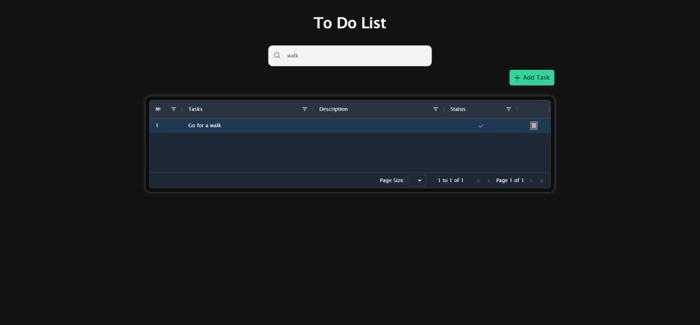

# 📋 To-Do Task Manager
To-Do Manager is a task management web application built with Angular and PrimeNG. It allows users to create, edit, and delete tasks, filter them with real-time search, and view task details via dynamic routing. The app persists data locally using localStorage. Designed with a responsive UI using AgGrid.

Built with **Angular**, **RxJS**, and **PrimeNG**, featuring:

- 📝 Add, edit, and delete tasks  
- 🔍 Instant search with debounce  
- 📊 Table view with sorting and filtering (AG Grid)  
- 📂 Task detail view via routing (`/tasks/:id`)  
- ✅ Form validation and UI feedback  
- 🧠 App-wide state management with `BehaviorSubject`  
- 💾 State persistence with `localStorage`

---

## 🚀 Features

- **Reactive Forms** for task creation/editing  
- **Drawer-based modal** to add new tasks  
- **UUID-based unique task IDs**  
- **Global app state** managed via custom `AppStateService`  
- **Search query and results managed via state**  
- **State persistence using `localStorage`** — tasks are not lost on reload  
- **Fully standalone components** using Angular 17+ architecture  
- **Responsive UI** with PrimeNG and custom SCSS styling  

---

## 📦 Technologies Used

- Angular 17+
- RxJS
- PrimeNG
- AG Grid
- TypeScript
- SCSS

---

## 🛠️ Getting Started

### 1. Clone the repo

git clone  https://github.com/Delyaday/todo-task-manager.git
cd todo-task-manager
```

### 2. Install dependencies
npm install

### 3. Run the development server
ng serve

Open your browser at (http://localhost:4200)


## 🧑‍💻 Author

Built by Adelya (https://github.com/delyaday) as a showcase Angular project.


## Project Screenshots




